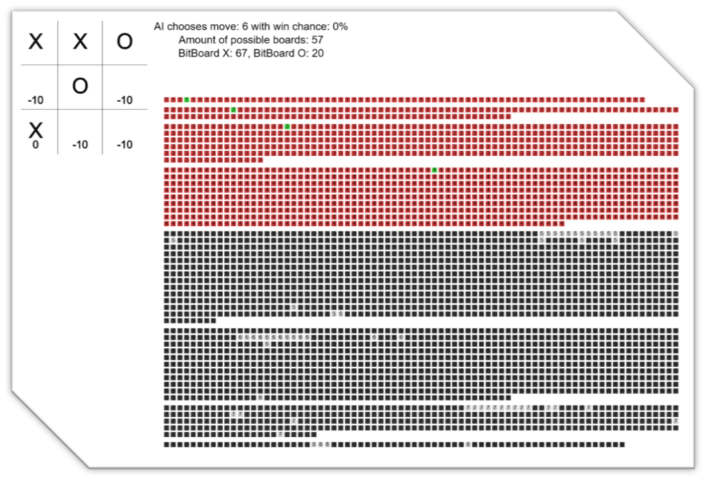

[GITHUB REPOSITORY](https://github.com/b-o9/Eksamen-Minmax-AlphaBetaPruning)
[Deployed link](https://github.com/b-o9/Eksamen-Minmax-AlphaBetaPruning)

This program is a visualization of the minmax algorithm with alpha-beta pruning, using a BitBoard. 
The visuals show a TicTacToe board where you can play against the minmax algorithm and the numbers on the board are the values that the algorithm has given each cell.
There're also some stats on the right, such as boards that are still possible, bitboard of current board, and the many buttons are to show all possible futures that are possible, as well as what have been chosen.

TicTacToe is used to show how minmax can maximize win chance.
Minmax is a algorithm that asumes the enemy is playing optimally and minimizes the score of the opponent. The goal of minmaxing is to get the highest value move possible.  
Alpha-beta pruning is an 'add-on' to minmax which makes it faster since it will skip branches if it's sure there's a better option. This only works since it assumes the enemy plays optimally.
The program uses bitboards which are often used in board games, because they enable the board to easily be stored and compared. They are memory efficient and easy to do operations on, like AND or XOR.

How to run:
Click the deployed link or download the project, and get the Live Server extension for VS Code and click "Go Live".